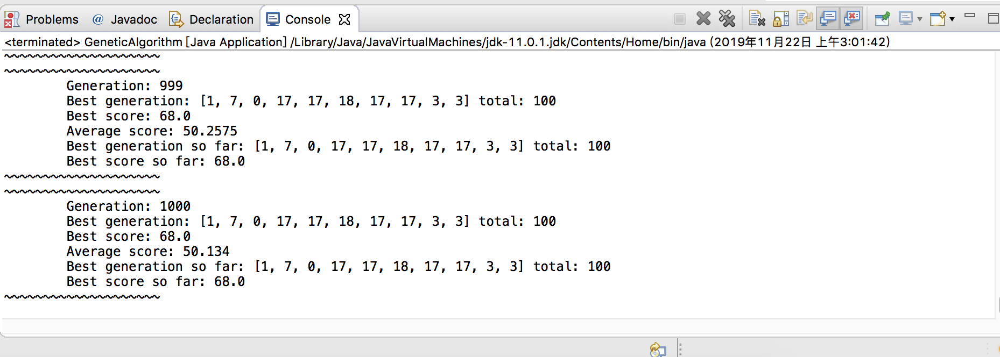
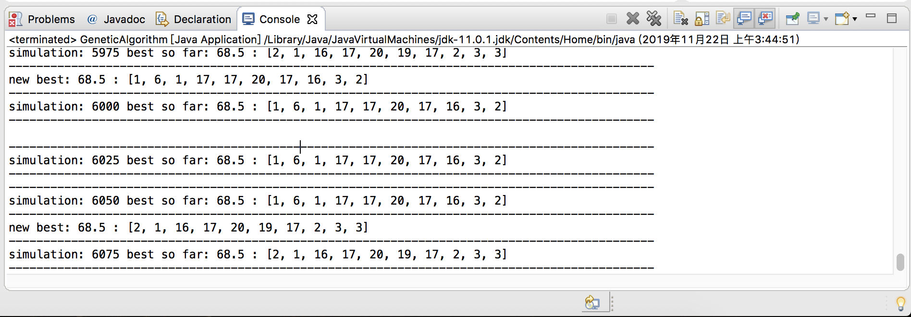
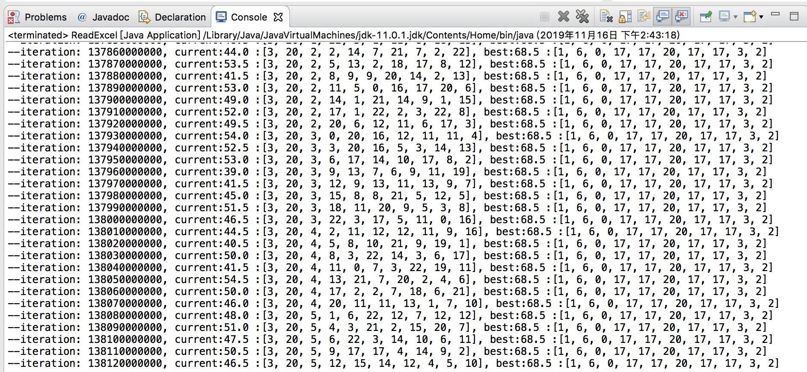

# BlottoGame
This project aims at finding the best distribution of resources in the Colonel Blotto Game through the genetic algorithm on discrete data.  

## Game Rule
The game is one class challenge of my CSE 21 class in which players can assign 100 soldiers to 10 castles and compete with other players' combinations castle by castle. A player earns 1 point by defeating the other player with more winning castles and 0.5 points if it is a tie. Given an [excel](https://github.com/Jameschen7/BlottoGame/blob/master/src/bg/dataset/blottoscores.xls) file consisting of 78 students' combinations, the goal of the project is to find a best combination that will gain the most points against them.

## Algorithm Implementation Details
* Chromosome: each chromosome represents a possible assignment of 100 soldiers to 10 castles in Blotto Game
* Adaptability: one character of every chromosome that is defined by the score against the given 78 combinations
* Random Initialization: this is done by assigning each of the 100 soldiers to a random castle for each chromosome in the initial population
* Crossover: due to the limit that the sum of solders must be 100, the concept of crossover is revised such that it will interchanges soldiers in two random castles from a single parent chromosome
* Mutation: the process of mutation happens after crossover by reassigning a soldier from a random castle into another random castle
* Reproduction: in order to accelerate the progress towards the maximum, the process of reproduction is deployed by reproducing the top few chromosomes of current generation into the next generation if they do not exist there yet; otherwise, reproduce the top few chromosomes with mutation to avoid the overquick progress towards a local maximum.
* Evolution: every evolustion is defined by a sequence of processes of crossover, mutation, reproduction, and recalculation of information of the population

## Result 
The result of a single simulation of the genetic algorithm:

The result of multiple simulations of the genetic algorithm:

The process of finding the best through a brute force method by exhausting every possibility:

## Efficiency Comparison
Overall, the genetic algorithm domenstrates an excellent suitability for questions seeking a global maximum like this.
